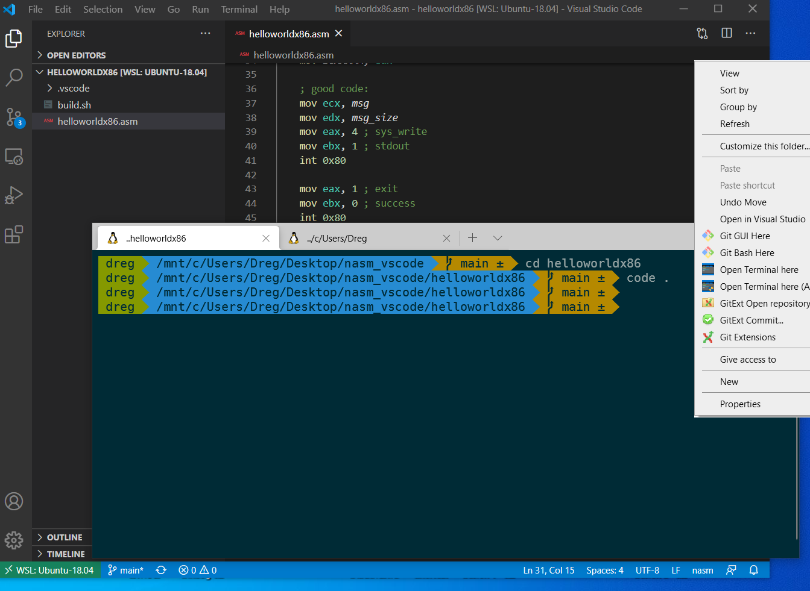

# nasm_vscode
Just use my helloworldx86 folder as your template for your nasm projects in windows 32/64 & linux 32/64. Press F1 in Visual Studio Code and run Task Build:


I added my own pattern-matcher in tasks.json for nasm errors & warning. Now you can see the "PROBLEMS" VSCODE-Window

# my setup

VSCODE Extensions:
* Remote - WSL: ms-vscode-remote.remote-wsl - https://marketplace.visualstudio.com/items?itemName=ms-vscode-remote.remote-wsl
* The Netwide Assembler (NASM): rights.nas-vscode - https://marketplace.visualstudio.com/items?itemName=rights.nas-vscode
* x86 and x86_64 Assembly: 13xforever.language-x86-64-assembly - https://marketplace.visualstudio.com/items?itemName=13xforever.language-x86-64-assembly

https://blog.nillsf.com/index.php/2020/02/17/setting-up-wsl2-windows-terminal-and-oh-my-zsh/

https://docs.microsoft.com/en-us/windows/wsl/install-win10

https://docs.microsoft.com/en-us/windows/terminal/get-started

cat ~/.zshrc 
```
...
alias explorer='/mnt/c/Windows/explorer.exe `wslpath -w "$PWD"`'
```

Terminal Shell Extension (copy with .reg extension and just execute it)
```
Windows Registry Editor Version 5.00

;Binary data is just UTF16 (LE) split every 2 bytes with a comma
;Conversion done with https://onlineutf8tools.com/convert-utf8-to-utf16?hex=true&little-endian=true&space=false&chain=split-string%253Fsplit-by-length%253Dtrue%2526separator%253D%252C

;User action
[HKEY_CLASSES_ROOT\Directory\Background\shell\WindowsTerminal]
@="Open Terminal here"
;"Icon"="%USERPROFILE%\Pictures\Icons\terminal.ico" (Location to ICO or comment out to hide icon)
"Icon"=hex(2):25,00,55,00,53,00,45,00,52,00,50,00,52,00,4f,00,46,00,49,00,4c,00,45,00,25,00,5c,00,50,00,69,00,63,00,74,00,75,00,72,00,65,00,73,00,5c,00,49,00,63,00,6f,00,6e,00,73,00,5c,00,74,00,65,00,72,00,6d,00,69,00,6e,00,61,00,6c,00,2e,00,69,00,63,00,6f,00

;User action command
[HKEY_CLASSES_ROOT\Directory\Background\shell\WindowsTerminal\command]
;@="%LOCALAPPDATA%\Microsoft\WindowsApps\wt.exe -d ."
@=hex(2):25,00,4c,00,4f,00,43,00,41,00,4c,00,41,00,50,00,50,00,44,00,41,00,54,00,41,00,25,00,5c,00,4d,00,69,00,63,00,72,00,6f,00,73,00,6f,00,66,00,74,00,5c,00,57,00,69,00,6e,00,64,00,6f,00,77,00,73,00,41,00,70,00,70,00,73,00,5c,00,77,00,74,00,2e,00,65,00,78,00,65,00,20,00,2d,00,64,00,20,00,2e,00

;Admin action
[HKEY_CLASSES_ROOT\Directory\Background\shell\WindowsTerminalAdmin]
@="Open Terminal here (Admin)"
;Show the UAC shield on the action
"HasLUAShield"=""
;"Icon"="%USERPROFILE%\Pictures\Icons\terminal.ico" (Location to ICO or comment out to hide icon)
"Icon"=hex(2):25,00,55,00,53,00,45,00,52,00,50,00,52,00,4f,00,46,00,49,00,4c,00,45,00,25,00,5c,00,50,00,69,00,63,00,74,00,75,00,72,00,65,00,73,00,5c,00,49,00,63,00,6f,00,6e,00,73,00,5c,00,74,00,65,00,72,00,6d,00,69,00,6e,00,61,00,6c,00,2e,00,69,00,63,00,6f,00

;Admin action command
[HKEY_CLASSES_ROOT\Directory\Background\shell\WindowsTerminalAdmin\command]
@="PowerShell -WindowStyle Hidden -Command \"Start-Process wt -ArgumentList '-d','.' -Verb runAs\""
```


